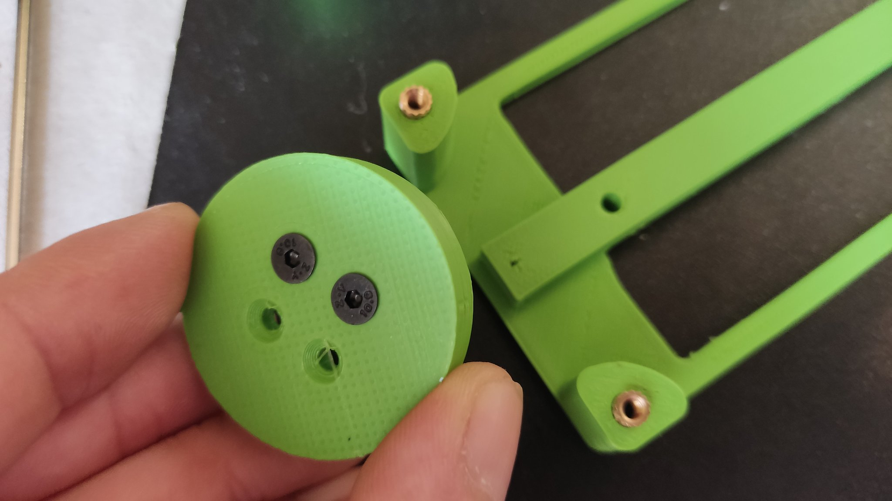

# Aria Salvatrice's WIP CMOS Synth

This repository aims to document the Lunetta-style modular CMOS synth I'm building to learn more about electronics. 

Wanna see it in action?

For now, this stuff is only provided publicly to solicit feedback. Depending on the quality of the completed synth and community interest, maybe I'll turn it into a proper open hardware project fit for human consumption one day. But for now, nobody should reproduce those builds, nor even attempt to learn something from them. I literally didn't know how to make a LED emit light rather than smoke at the start of 2022. I have no clue what I'm doing.

Software you need to open the source files I'm sharing:
- Schematics use [KiCad](https://www.kicad.org/) 6.99+
- Layouts use [DIY Layout Creator](http://diy-fever.com/software/diylc/)
- 3D prints use [FreeCAD](https://www.freecadweb.org/)

Other than this file repository, I document my build process [in a thread on the Look Mum No Computer forum](https://lookmumnocomputer.discourse.group/t/starting-a-little-cmos-synth-build/5375/), post the infrequent video [on my Youtube](https://www.youtube.com/c/AriaSalvatrice), sometimes lurk [/r/synthdiy](https://old.reddit.com/r/synthdiy/), and spam [excessively detailed updates in between the gay shitposts on my personal Tweeter that nobody should follow](https://twitter.com/AriaSalvatrice). 

## About Lunetta and CMOS synths

CMOS synths primarily focus primarily on exploring the interactions of the CMOS 4000 series of chips, which deal with digital logic, signals that are either high or low. Compared to more advanced synth DIY endeavors, they are rather easy to build and understand, cheap to make, and reward experimentation. They are sometimes named after [Stanley Lunetta](http://moosack.net/), who pioneered this style of circuit, and called his work _sound sculptures_. 

Your best introduction to musical applications of CMOS chips would be [Elliot Williams' Logic Noise series](https://hackaday.com/series_of_posts/logic-noise/). To dig deeper, explore over a decade of archives in the [Lunetta forums on electro-music.com](https://electro-music.com/forum/forum-160.html), and read the in-depth circuit analyses of the [Castle Rocktronics](http://castlerocktronics.com/modular.html) modules. 

## Design Goals

Mostly learning electronics for myself, and ending up with a neat little rhythm machine, for now. But it'd be cool if I could eventually turn the best circuits into multiple dedicated PCBs, that you could wire up either with pin headers, or cables going to banana jacks on a panel for a more traditional Lunetta setup.

## Electrical Design

All the guts of the synth are exposed as bare PCBs with male header pins, that the performer patches with female DuPont cables. The small size makes it unsuited for live patching, but exceptionally well suited to experimentation with breadboards.

As there are no panels, the aesthetics of the PCBs are important. When performing on video, they must provide a fun and colorful visual spectacle with mucho Blinkenlichten. They must also double as a reasonably ergonomic user interface.

The system runs on +12V DC. It will also work on +9V, but the values are tuned for +12V, so pitches and envelopes are different at +9V. Some of the circuits I made no longer seem to work at +5V. I picked +12V to make it easier to integrate to a modular synth in the future. There is no dedicated power module yet, it runs off a bench PSU.

To keep the patches readable for the performer, most of the hardwiring is run below the boards. 

Most of the circuits used were designed by much more competent people and shared under permissive terms. Individual credits are provided for each module. If you want to learn, learn from the originals, not from my stuff.

## Mechanical Design

The modules are currently printed with PLA. The models were made with FreeCAD. As I don't know FreeCAD well, they are not as easy to modify as I like and can require some post-processing in Blender, the main value of the FreeCAD project is to have a set of measurements that works pretty well. 

The modules tile to an approximate 60×60mm grid. This allows integrating 100×100mm PCBs in 120×120mm modules comfortably, the maximum size for which some PCB fab houses cut you a special deal for minimum quantity orders.

The modules are held together by their feet with little holding rings that look like buttons, taking countersunk screws. The holes in the feet of modules are reinforced with heat set inserts.

The models should not require a particularly well tuned printer to make. Most can be printed without supports and don't require much post-processing.

Here's the main measurements (will add more as I confirm them precisely):

| Dimension Name | Value | Comments |
|----------------|-------|----------|
| Grid size | 60 × 60 mm 
| Height of modules | 18 mm | Tall enough for vertical headers below the boards, but angled are preferred.
| Spacing between modules | 0.8 mm | Currently, 120×120mm modules don't account for this properly.

## Licensing

lol

-----------

Thanxx for peeping my project. Feel free to look at my learning process, but do not treat my schematics and layouts as instructions yielding an usable product.

Send me thoughts and dog gifs to <woof@aria.dog>.

ttyl,

